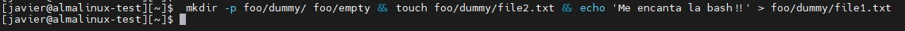
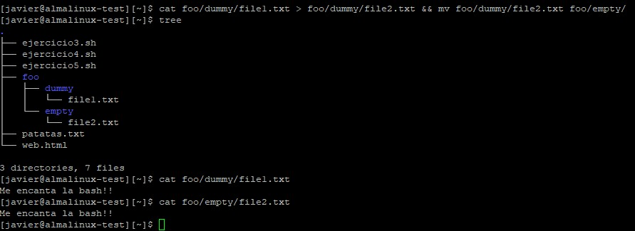

# Bootcamp Devops IV - Laboratorio Módulo 1 - Fundamentos de Linux

## Ejercicios

### Ejercicios CLI

**NOTA**: Aunque aquí aparecen los códigos de los ejercicios, los ficheros .sh de los scripts están disponibles en le directorio scripts

#### 1. Crea mediante comandos de bash la siguiente jerarquía de ficheros y directorios

```
foo/
├─ dummy/
│ ├─ file1.txt
│ ├─ file2.txt
├─ empty/
```

Donde file1.txt debe contener el siguiente texto:

`Me encanta la bash!!`

Y file2.txt debe permanecer vacío.

Ejecutaremos todos los pasos en una única línea con los comandos siguientes.

```
 mkdir -p foo/dummy/ foo/empty && touch foo/dummy/file2.txt && echo 'Me encanta la bash!!' > foo/dummy/file1.txt
```

Explicación:

- Con **mkdir** y la flag **-p** creamos el directorio foo y los subdirectorios dummy y empty

- Con el operador **&&** iremos ejecutando los comandos siguientes si el anterior no ha fallado

- Con **touch** creamos los ficheros vacíos

- Con **echo** imprimimos en la salida estándar el mensaje que deseamos y lo redireccionamos al fichero en cuestión con **>**

A continuación se muestra un ejemplo de ejecución del comando anterior



Después lanzaremos un **tree** para ver la jerarquía creada como se aprecia en la siguiente imagen


Y por último hacemos un **cat** al file1.txt vemos el texto que hemos escrito y redirigido.


#### 2. Mediante comandos de bash, vuelca el contenido de file1.txt a file2.txt y mueve file2.txt a la carpeta empty

El resultado de los comandos ejecutados sobre la jerarquía anterior deben dar el siguiente resultado.

```
   foo/
   ├─ dummy/
   │ ├─ file1.txt
   ├─ empty/
   ├─ file2.txt
```

Donde file1.txt y file2.txt deben contener el siguiente texto:

`Me encanta la bash!!`

Ejecutaremos un cat al fichero1.txt y lo redireccionamos al fichero file2.txt para volcar el contenido a file2.txt y después lo moveremos con el comando mv

```
   cat foo/dummy/file1.txt > foo/dummy/file2.txt && mv foo/dummy/file2.txt foo/empty/
```

Se hace uso de && pero igualmente se puede hacer con ;

Luego lanzamos un **tree** para verificar la jerarquía y por último un **cat** a los ficheros para ver que el contenido es el mismo.



#### 3. Crear un script de bash que agrupe los pasos de los ejercicios anteriores y además permita establecer el texto de file1.txt alimentándose como parámetro al invocarlo. Si se le pasa un texto vacío al invocar el script, el texto de los ficheros, el texto por defecto será:

`Que me gusta la bash!!!!`

```
#!/bin/bash
#
# Ejercicio 3 Laboratorio Módulo1 Fundamentos Linux Bootcamp DevOps Lemoncode
# Alumno: Javier Rodríguez
#

# Controlar el número de parámetros
if [ $# -gt 1 ]; then

	echo "ERROR!!Se necesita un sólo parámetro!!"

else

	# Evaluar si se ha introducido un parámetro para asignar un valor concreto a la variable texto
	if [ $# -eq 0 ]; then

		texto='Que me gusta la bash!!!!'

	else

        texto=$1

	fi

# Creamos directorio foo y subdirectorios dummy y empty
mkdir -p foo/dummy/ foo/empty

# Creamos los ficheros file1.txt y file2.txt
touch foo/dummy/file1.txt foo/dummy/file2.txt

# Hacemos un echo de la variable texto y lo redireccionamos a file1.txt
echo "$texto" > foo/dummy/file1.txt

# Ahora volcamos el contenido file1.txt a file2.txt
cat foo/dummy/file1.txt > foo/dummy/file2.txt

# Movemos file2
mv foo/dummy/file2.txt foo/empty/

fi
```

A continuación un ejemplo de ejecución si no le pasamos un parámetro


Aquí tenemos un ejemplo de ejecución si le pasamos un parámetro


Por último que sucede si metemos más de un parámetro


#### 4. Crea un script de bash que descargue el contenido de una página web a un fichero y busque en dicho fichero una palabra dada como parámetro al invocar el script.

#### La URL de dicha página web será una constante en el script. Si tras buscar la palabra no aparece en el fichero, se mostrará el siguiente mensaje:

```
$ ejercicio4.sh patata
> No se ha encontrado la palabra "patata"
```

#### Si por el contrario la palabra aparece en la búsqueda, se mostrará el siguiente mensaje:

```
$ ejercicio4.sh patata
> La palabra "patata" aparece 3 veces
> Aparece por primera vez en la línea 27
```

```
#!/bin/bash
#
# Ejercicio 4 Laboratorio Módulo1 Fundamentos Linux Bootcamp DevOps Lemoncode
# Alumno: Javier Rodríguez
#

# Constante URL
url='https://lemoncode.net/'

if [ $# -ne 1 ];then

	 echo "ERROR: Debe introducir una única palabra a buscar"

else

	# Descarga de la web en un fichero de forma silenciosa
	curl -s $url -o web.html

	# Búsqueda silenciosa de la palabra pasada como parámetro
	grep -q "$1"  web.html

	# Almacenamos el exit code del comando anterior
	# 0: palabra no encontrada
	# Distinto de 0: palabra encontrada
	Cod_Salida=$?

	# Si no hay ocurrencias se muestra mensaje, si se encuentra la palabra se almacena el número de ocurrencias y la primera línea en la que aparece la palabra
	if [ $Cod_Salida -ne 0 ]; then

			echo "NO se ha encontrado la palabra $1"
	else

			ocurrencias=$(grep -o "$1" web.html | grep -c "$1")
			echo "La palabra $1 aparece $ocurrencias veces"

			num_linea=$(grep -m1 -n "$1" web.html | awk -F ":" '{print $1}')
			echo "Aparece por primera vez en la línea $num_linea"
	fi
fi

```

A continuación se muestra unos ejemplos de ejecución de este ejercicio


#### 5. OPCIONAL - Modifica el ejercicio anterior de forma que la URL de la página web se pase por parámetro y también verifique que la llamada al script sea correcta.

#### Si al invocar el script este no recibe dos parámetros (URL y palabra a buscar), se deberá de mostrar el siguiente mensaje:

```
$ ejercicio5.sh https://lemoncode.net/ patata 27
> Se necesitan únicamente dos parámetros para ejecutar este script
```

#### Además, si la palabra sólo se encuentra una vez en el fichero, se mostrará el siguiente mensaje:

```
$ ejercicio5.sh https://lemoncode.net/ patata
La palabra "patata" aparece 1 vez
Aparece únicamente en la línea 27
```

```
#!/bin/bash
#
# Ejercicio 5 Laboratorio Módulo1 Fundamentos Linux Bootcamp DevOps Lemoncode
# Alumno: Javier Rodríguez

# Variables
url=$1
palabra=$2
num_args=$#

if [ $num_args -ne 2 ]; then

        echo "Se necesitan únicamente dos parámetros para ejecutar este script"

else

        #Descarga de la web en un fichero de forma silenciosa
        curl -s "$url" -o web.html

        # Búsqueda silenciosa de la palabra pasada como parámetro
        grep -q "$palabra"  web.html

        # Almacenamos el exit code del comando anterior que será evaluado a continuación, si es 0 la palabra no fue encontrada si es diferente es encontrada y buscaremos las ocurrencias y cual es la primera línea en la que aparece
        Cod_Salida=$?

        if [ $Cod_Salida -ne 0 ]; then

                echo "NO se ha encontrado la palabra $palabra"
        else

                ocurrencias=$(grep -o "$palabra" web.html | grep -c "$palabra")
                num_linea=$(grep -m1 -n "$palabra" web.html | awk -F ":" '{print $1}')

                if [ "$ocurrencias" -eq 1 ]; then

                        echo "La palabra $palabra aparece 1 vez"
                        echo "Aparece únicamente en la línea $num_linea"

                else

                        echo "La palabra $palabra aparece $ocurrencias veces"
                        echo "Aparece por primera vez en la línea $num_linea"

                fi
        fi
fi
```

A continuación se muestra un ejemplo de ejecución de este ejercicio


