# LABORATORIO MÓDULO 2 - CONTENEDORES DOCKER

## Ejercicio 1

Dockeriza la aplicación dentro de lemoncode-challenge, la cual está compuesta de 3 partes:

- Un front-end con Node.js

- Un backend en .NET (dotnet-stack) o en Node.js (node-stack) que utiliza un MongoDB para almacenar la información.

- El MongoDB donde se almacena la información en una base de datos.

Nota: como has podido comprobar, el directorio lemoncode-challenge tiene dos carpetas: dotnet-stack y node-stack. En ambos casos el frontend es el mismo, sólo cambia el backend. Usa el stack que prefieras.

Requisitos del ejercicio:

1. Los tres componentes deben estar en una red llamada lemoncode-challenge.
2. El backend debe comunicarse con el mongodb a través de esta URL mongodb://some-mongo:27017.
3. El front-end debe comunicarse con la api a través de http://topics-api:5000/api/topics.
4. El front-end debe estar mapeado con el host para ser accesible a través del puerto 8080.
5. El MongoDB debe almacenar la información que va generando en un volumen, mapeado a la ruta /data/db.
6. Este debe de tener una base de datos llamada TopicstoreDb con una colección llamada Topics.

La colección Topics debe tener esta estructura:

```
    {
        "_id": { "$oid" : "5fa2ca6abe7a379ec4234883" },
        "Name" : "Contenedores"
    }
```

¡Añade varios registros!

**Tip para backend**: Antes de intentar contenerizar y llevar a cabo todos los pasos del ejercicio se recomienda intentar ejecutar la aplicación sin hacer cambios en ella. En este caso, lo único que es posible que “no tengamos a mano” es el MongoDB. Por lo que empieza por crear este en Docker, usa un cliente como el que vimos en el primer día de clase (MongoDB Compass) para añadir datos que pueda devolver la API.

Nota: es más fácil si abres Visual Studio Code desde la carpeta backend para hacer las pruebas y las modificaciones que si te abres desde la raíz del repo. Para ejecutar este código solo debes lanzar dotnet run si usas el stack de .NET, o npm install && npm start si usas el stack de Node.js.

**Tip para frontend**: Para ejecutar el frontend abre esta carpeta en VS Code y ejecuta primero npm install. Una vez instaladas las dependencias ya puedes ejecutarla con npm start.

**RESOLUCIÓN EJERCICIO**

A continuación se describen los pasos seguidos para resolver el ejercicio

- CREAR RED LEMONCODE-CHALLENGE

`$ docker network create lemoncode-challenge`

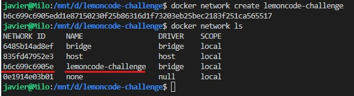

- CREAR VOLUMEN DATA

`$ docker volume create data`

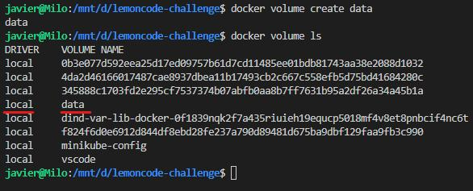

- CREAR CONTENEDOR MONGO CON VOL Y RED CREADAS EN LOS PASOS ANTERIORES

`$ docker run -d --name some-mongo --mount source=data,target=/data/db --network=lemoncode-challenge -p 27017:27017 mongo`

- CREAR DOCKERFILE BACKEND

NOTA: El dockerfile está disponible en el directorio lemoncode-challenge > node-stack > backend

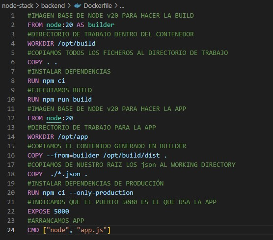

- CREAR DOCKERIGNORE PARA BACKEND

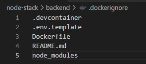

- CREAR DOCKERFILE FRONTEND

NOTA: El dockerfile está disponible en el directorio lemoncode-challenge > node-stack > frontend

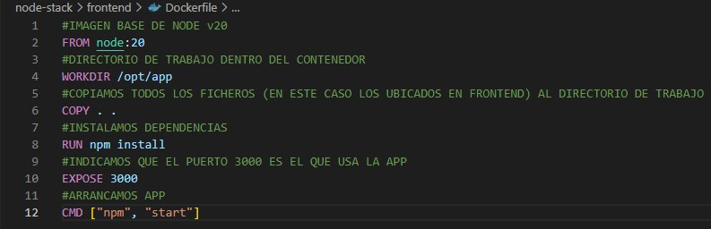

- CREAR DOCKERIGNORE PARA FRONTEND

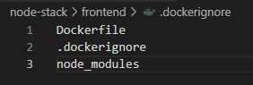

- CREAR IMAGEN BACKEND

`$ docker build -t backend .`

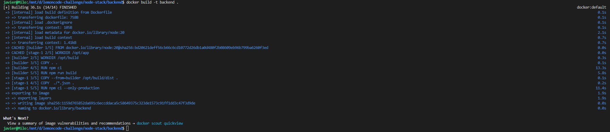

- CREAR IMAGEN FRONTEND

`$ docker build -t frontend .`

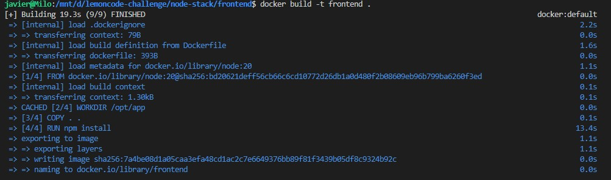

- COMPROBAR QUE SE HAN CREADO IMAGENES

`$ docker images`

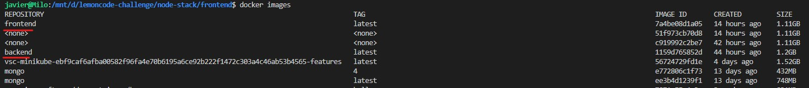

- CREAR CONTENEDOR BACKEND topics-api

`$ docker run -d -e DATABASE_URL="mongodb://some-mongo:27017" --name  topics-api --network=lemoncode-challenge -p 5000:5000 backend`

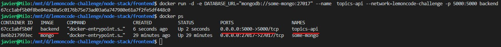

- CREAR CONTENEDOR FRONTEND topics accesible por el puerto 8080

`$ docker run -d --name topics -p 8080:3000 -e API_URI=http://topics-api:5000/api/topics --network lemoncode-challenge frontend`

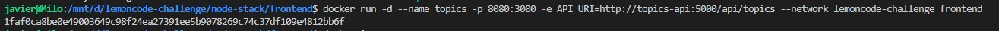

- COMPROBAR QUE ESTÁ FUNCIONANDO

Desde el host, ejecutamos los curl siguientes para meter datos

`curl -d '{"Name":"Devops"}' -H "Content-Type: application/json" -X POST http://localhost:5000/api/topics`

`curl -d '{"Name":"K8s"}' -H "Content-Type: application/json" -X POST http://localhost:5000/api/topics`

Ahora comprobamos que se ven en el navegador

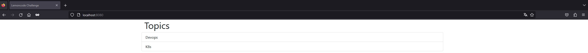

## Ejercicio 2

Ahora que ya tienes la aplicación del ejercicio 1 dockerizada, utiliza Docker Compose para lanzar todas las piezas a través de este. Debes plasmar todo lo necesario para que esta funcione como se espera: la red que utilizan, el volumen que necesita MongoDB, las variables de entorno, el puerto que expone la web y la API. Además debes indicar qué comandos utilizarías para levantar el entorno, pararlo y eliminarlo.

**RESOLUCIÓN EJERCICIO**

- CREAR DOCKER COMPOSE

NOTA: El docker-compose está disponible en el directorio lemoncode-challenge

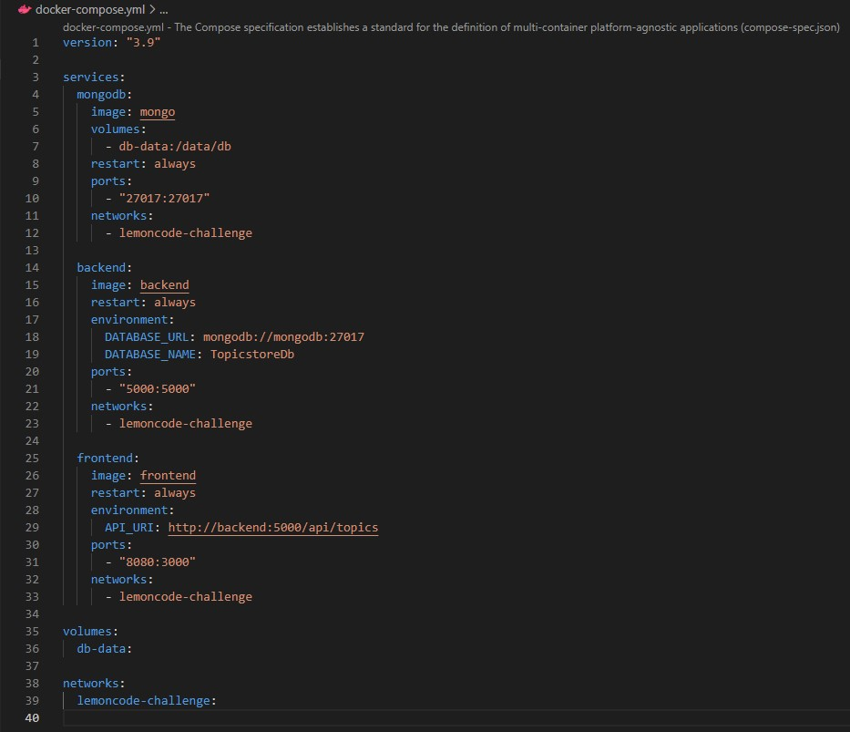

- EVANTAR ENTORNO

`$ docker compose up`

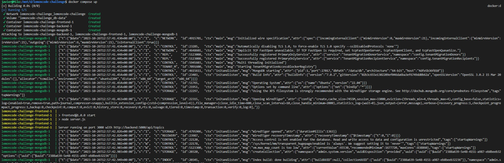

Comprobamos que se han levantado los contenedores

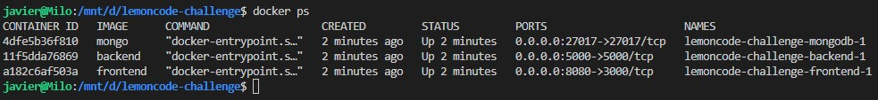

Abrimos en un navegador localhost:8080

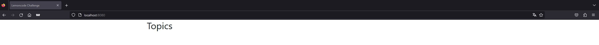

Lanzamos los siguientes curl en nuestro host para cargar datos

`curl -d '{"Name":"Devops"}' -H "Content-Type: application/json" -X POST http://localhost:5000/api/topics`

`curl -d '{"Name":"K8s"}' -H "Content-Type: application/json" -X POST http://localhost:5000/api/topics`

Refrescamos la página y vemos los datos.

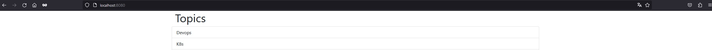

- PARAR ENTORNO

`$ docker compose stop`

Ejecutamos también un docker ps -a para ver que se han parado

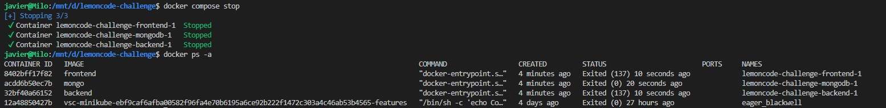

- ELIMINAR CONTENEDORES PARADOS

`$ docker compose rm`

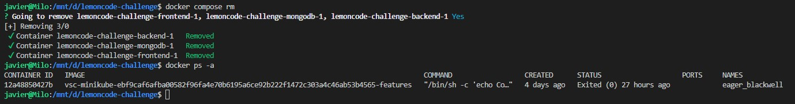

En el caso que los contenedores estuvieran corriendo y deseáramos pararlos y eliminarlos, ejecutaríamos el comando siguiente.

`$ docker compose shutdown`

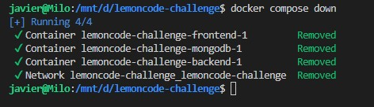

Como se aprecia en la imagen no sólo se eliminan los contenedores, también se elimina la red.
